## Автоматизированная станция заправки

***

[Содержание](#содержание)

[Введение](#введение)

1 [Описание предметной области](#предметная_область)

1.1 [Проблематика](#проблематика)

1.2 [Цели и задачи](#цели_и_задачи)

2 [Сравнительный анализ](#сравнительный_анализ)

3 [Разработка системы](#разработка_системы)

3.1 [Этап проектирования](#проектирование)

3.2 [Этап реализации](#реализация)

4 [Тестирование](#тестирование)

[Заключение](#заключение)

[Список использованных источников](#список_использованных_источников)

***

## Введение 
***

 Современные технологии сделали возможным автоматизировать некоторые услуги, полностью или частично отказавшись от присутствия персонала, что позволяет бизнесу экономить немалые деньги, а также исключаются ошибки, связанные с человеческим фактором. Одной из таких услуг стала продажа бензина на специальных автоматизированных заправках. В последнее время такой тенденции стали следовать в сети АЗС "Газпром".

***
## 1 Описание предметной области 
***

Информационная система обеспечивает функционирование клиента, заправщика, и несколько заправочных станций. 

 Клиент - это человек, который будет получать услугу. Клиент может проссматривать актуальные акции и цены на топливо, оформлять заказ, писать отзывы как положительного, так и отрицательного характера.

 Администратор - управляет акциями, обновляет цены, регистрирует карты лояльности на клиентов. Он работает в удаленном доступе, что позволяет ему контролировать сразу несколько автоматизированных автозаправочных станций.
 
 Заправщик - работник станции, предназначенный для исправления ошибок работы автозаправки в реальном времени и после получения отзыва об ошибке. 
Оформление заказа. Заказ формируется в специальном хранилище, где указываются вид топлива, его количество, сумма заказа с учетом скидки по карте лояльности, данные о клиенте и его автомобиле. Далее происходит оплата заказа. Если оплата проходит успешно, заказ отправляется в хранилище заправки и ожидает начала выполнения. После окончания заправки, заказу присваивается статус "Успешно", который впоследствии остается в хранилище.

  В случае непрохождения оплаты возникает ошибка, которая приводит к сбою процесса заправки. 
 Ошибка может возникнуть в трех случаях.
 1) Отказ оплаты.
 2) Отсутствие топлива в баке АЗС.
 3) Другие технические неполадки.
 
  Все возможные ошибки, их номера и названия, пути решения определены в специальное хранилище. Сбой процесса реализации заправки предполагает его скорейшее восстановление заправщиком. При отсутствии топлива в топливных баках АЗС, отправляется специальный запрос на их пополнение.
  
  Отзыв. Данный пользовательский раздел предназначен для улучшения качества работы сервиса автоматизированных заправочных станций. Отзывы делятся на два вида.
  1) Положительный отзыв о работе АЗС.
  2) Отзыв, содержащий указание на ошибку в работе станции.
  
  Они хранятся в отдельном хранилище. После все отзывы проходят сортировку. Отзывы, в которых удалось выявить ошибки, помещаются в хранилище ошибок. Далее они исправляются заправщиком. Положительные отзывы отправляются администратору, для формирования данных об эффективной работе данной станции. 
  
  Система лояльности предполагает использование клиентами именных карт, для привлечения клиентов и их поощрения за пользование услугой заправки автомобиля. На одну карту может быть зарегистрирован один клиент, но он в свою очередь может иметь неограниченное количество автомобилей, что делает систему лояльности гибкой и малозатратной.

***
## 1.1 Проблематика 
***

 В настоящее время существуют автозаправочные станции, которые отнимают много времени у водителей. Стандартная схема такова, что для оформления заказа клиент должен подождать, когда освободиться свободная колонка, после выйти из автомобиля и выстоять очередь в кассу для оплаты заказа, и наконец дождаться заправки автомобиля. На это уходит слишком много времени.
 Также на АЗС работает большое количество сотрудников, на которых ежемесячно уходит значительная часть прибыли.
 
***
## 1.2 Цели и задачи 
***

 Цель данного проекта - упрощение получения услуги заправки автомобиля. Для осуществления данной цели предполагается выполнить следующие задачи.

1) Автоматизировать заправочные станции.
2) Ускорить процесс реализации заправки.
3) Упростить процесс оформления заказа.
4) Сократить число сотрудников АЗС.

***
## 2 Сравнительный анализ 
***

 Заправочные автоматические терминалы могут принимать наличные денежные средства, а также карты. При обустройстве станций можно выполнить либо считыватель для магнитных карт либо приемник для купюр. Очень часто для заправок выбирают оба устройства, чтобы обеспечить удобство оплаты для большего количества клиентов станции. В различных странах и городах соотношение оплаты купюрами и картой разниться.

 Автоматические АЗС чаще всего принимают от трех до 4 видов номиналов, выбираются самые распространенные. Новая информационная система позволяет использовать любой вид номинала, в том числе и монеты.
 
***

## 3 Разработка системы 
***

 Разработка информационной системы делится на два этапа: проектирование и реализация. Проектирование является начальным уровнем разработки. На данном этапе описываются система и ее элементы, конкретные требования к системе, а также конкретные технические, программные и художественные решения. 
 На этапе реализации результаты проектирования преобразуются в готовый программный продукт. Здесь же происходит создание интерфейса и написание программного кода.
  
*** 
## 3.1 Этап проектирования 
***

 Определение главных действующих лиц и их основных функций в информационной системе реализовано на диаграмме Use Case, представленной на рисунке 1.
 
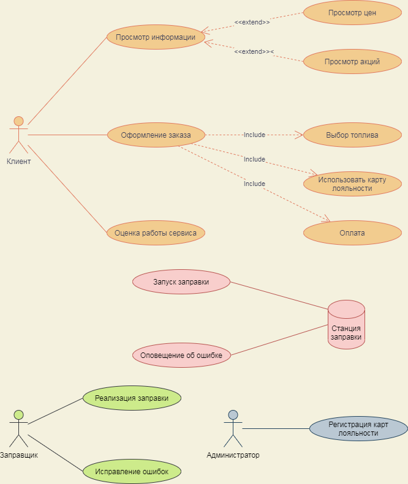
Рисунок 1 - Диаграмма Use Case

 На диаграмме потоков данных (Data-flow diagram), изображено как процессы и хранилища связаны потоками данных. Это показано на рисунке 2.

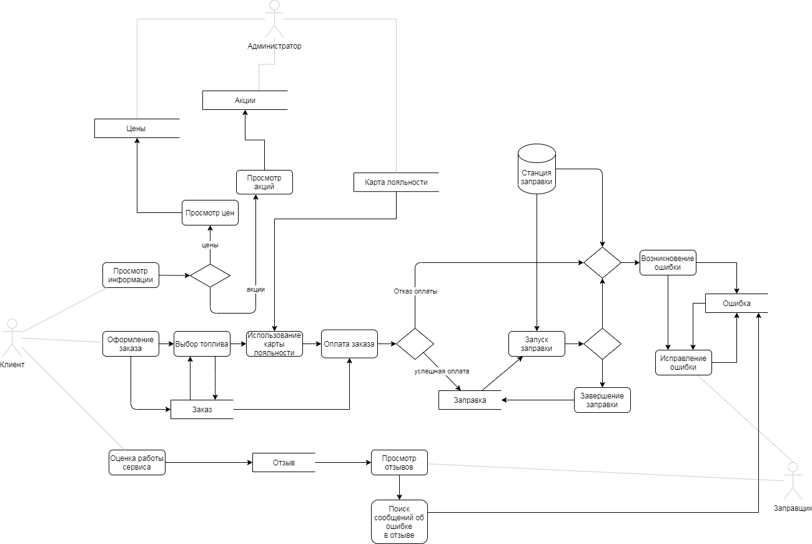
Рисунок 2 - Диаграмма потоков данных

 На диаграмме Сущность-Связь (Entity-Relationship diagram) отображены сущности (хранилища) и связи между ними. Это изображено на рисунке 3.

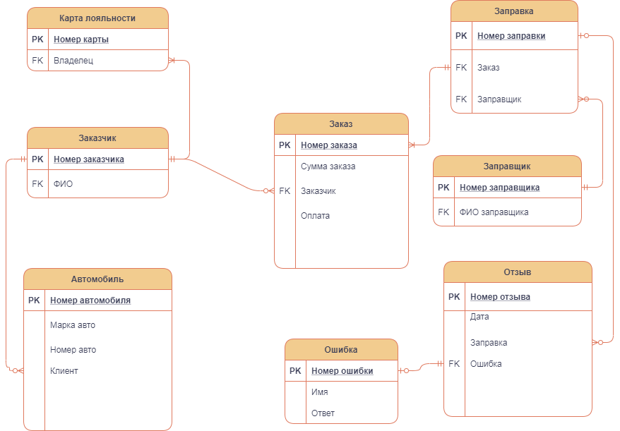
Рисунок 3 - Диаграмма Сущность-Связь

***
## 3.2 Этап реализации 
***

На основании ER диаграммы для каждой сущности был создан класс с указанием свойств, параметров и типов данных. Приведем пример создания класса для сущности Car. 

~~~csharp
namespace gas_station.Domain
{
    public class Car
    {
        public int CarId { get; set; }
        public string BrandCar { get; set; }
        public string Number { get; set; }
    }
}
~~~

Далее были созданы классы для других сущностей. Это показано на рисунке 4.

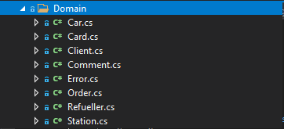
Рисунок 4 - Классы других сущностей

Далее для сущности Car реализуем контроллер с методами CRUD (create, read, update, delete).

~~~csharp
using gas_station.Domain;
using gas_station.Repository;
using Microsoft.AspNetCore.Mvc;

namespace gas_station.Controllers
{
    [ApiController]
    [Route("/car")]
    public class CarController : ControllerBase
    {
        [HttpPut]
        public Car Create(Car car)
        {
            Storage.CarStorage.Create(car);
            return car;
        }

        [HttpGet]
        public Car Read(int carId)
        {
            return Storage.CarStorage.Read(carId);
        }

        [HttpPatch]
        public Car Update(int carId, Car newCar)
        {
            return Storage.CarStorage.Update(carId, newCar);
        }

        [HttpDelete]
        public bool Delete(int carId)
        {
            return Storage.CarStorage.Delete(carId);
        }
    }
}
~~~      

 После реализованы контроллеры для остальных сущностей на рисунке 5.
 
 
 Рисунок 5 - Контроллеры других сущностей
 
 После создания репозитория, было создано хранилище для сущности Car.
 
~~~csharp
using gas_station.Domain;
using System.Collections.Generic;

namespace gas_station.Repository
{
    public class CarStorage
    {
        private Dictionary<int, Car> Cars { get; } = new Dictionary<int, Car>();

        public void Create(Car car)
        {
            Cars.Add(car.CarId, car);
        }

        public Car Read(int CarId)
        {
            return Cars[CarId];
        }

        public Car Update(int CarId, Car newCar)
        {
            Cars[CarId] = newCar;
            return Cars[CarId];
        }

        public bool Delete(int CarId)
        {
            return Cars.Remove(CarId);
        }
    }
}
~~~

 Далее были созданы хранилища для остальных сущностей на рисунке 6. 
 
 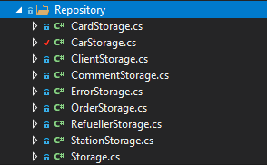
 Рисунок 6 - Контроллеры других сущностей
 
 Создание общего хранилища.
 
~~~csharp
 namespace gas_station.Repository
{
    public static class Storage
    {
        public static CardStorage CardStorage { get; } = new CardStorage();
        public static CarStorage CarStorage { get; } = new CarStorage();
        public static ClientStorage ClientStorage { get; } = new ClientStorage();
        public static CommentStorage CommentStorage { get; } = new CommentStorage();
        public static ErrorStorage ErrorStorage { get; } = new ErrorStorage();
        public static OrderStorage OrderStorage { get; } = new OrderStorage();
        public static RefuellerStorage RefuellerStorage { get; } = new RefuellerStorage();
        public static StationStorage StationStorage { get; } = new StationStorage();
       
    }
}
~~~
  
***
## 4 Тестирование 
*** 

В качестве тестирования информационной системы была выполнена проверка работы контроллеров в Swagger UI. 

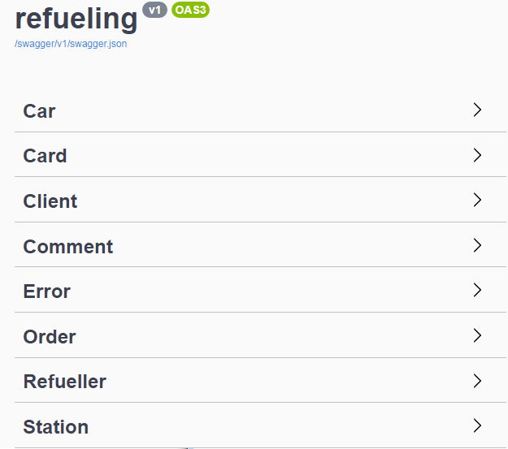

Покажем работу основных методов CRUD на сущности Car.

1. С помощью операции Create можно создавать новые записи в таблице.

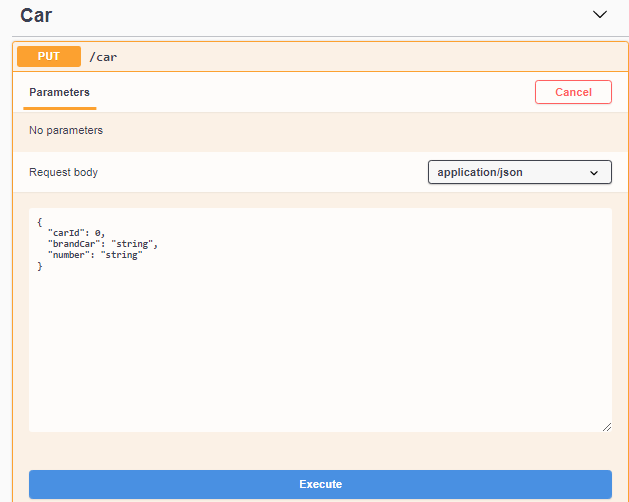

Создадим запись о некотором автомобиле:

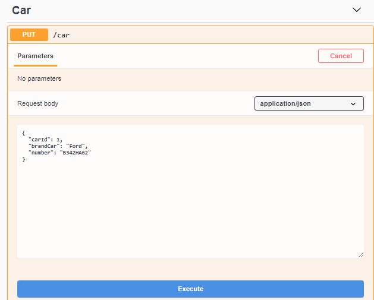

В результате получим следующее:

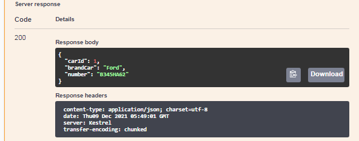

2. Метод Read позволяет считать значение записи, выбранной по определенному критерию.

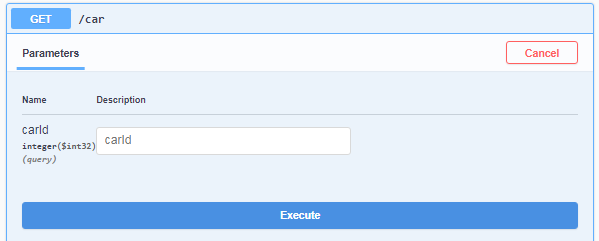

Прочитаем информацию об автомобиле с ID=1:

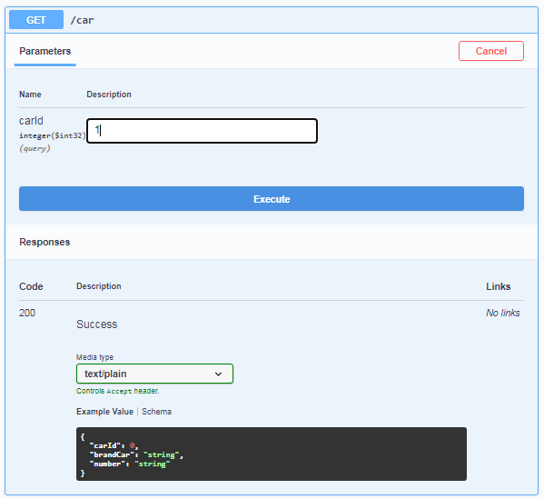

В результате получим:

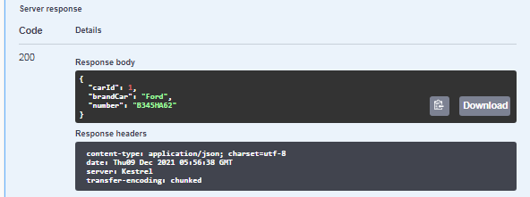

3. Операция Update позволяет изменить запись.

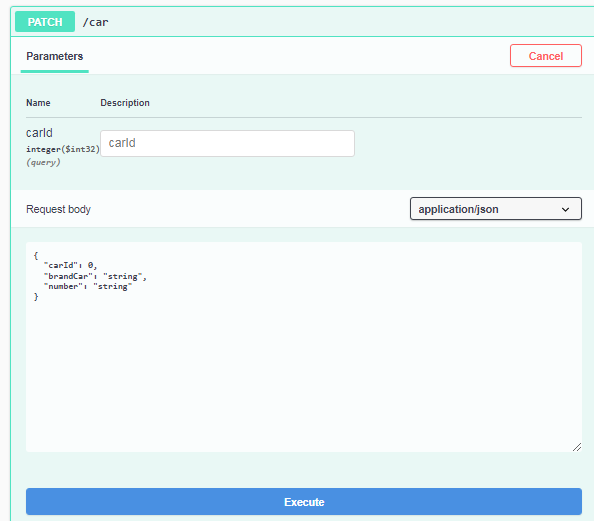 

Изменим у нашего автомобиля марку:

В результате получим новый автомобиль:

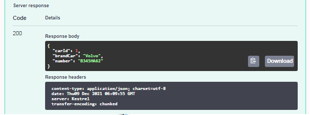

4. Метод Delete удаляет записи. В случае успешного удаления выводится true, иначе - false.

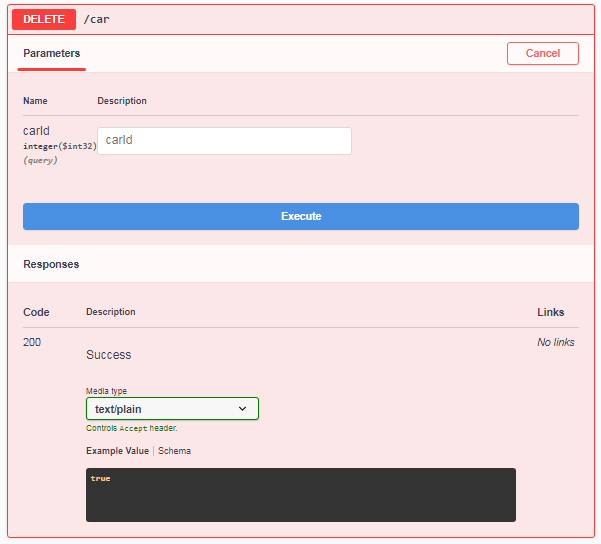

Удаление записи об автомобиле:

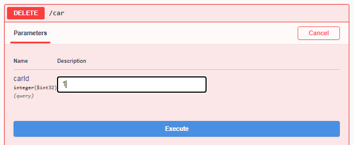

В результате получено:

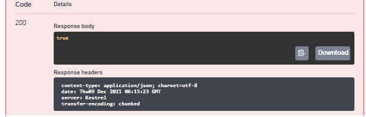

***
## Заключение 
***

 В результате проделанной работы были достигнуты поставленные цели и задачи проекта. В процессе проектирования удалось реализовать и протестировать информационную систему "Автоматизированную станцию заправки". Данная информационная система выполняет функции создания, чтения, редактирования и удаления записей. Проблема, поставленная в начале работы, была решена в процессе разработки информационной системы.  

***
## Список использованных источников 
***

1. Контроллеры и их действия. METANIT.COM [Электронный ресурс]. – Режим доступа: https://metanit.com/sharp/aspnet5/5.1.php, свободный (дата обращения: 30.09.2021).
2. Учебное пособие по диаграмме вариантов использования UML. Lucidchart [Электронный ресурс]. – Режим доступа: https://www.lucidchart.com/pages/uml-use-case-diagram, свободный (дата обращения: 08.10.2021).
3. Что такое диаграмма DFD и как ее создать? Lucidchart [Электронный ресурс]. – Режим доступа: https://www.lucidchart.com/pages/ru/%D0%B4%D0%B8%D0%B0%D0%B3%D1%80%D0%B0%D0%BC%D0%BC%D0%B0-dfd, свободный (дата обращения: 20.10.2021).
4. Что такое ER-диаграмма и как ее создать? Lucidchart [Электронный ресурс]. – Режим доступа: https://www.lucidchart.com/pages/ru/erd-%D0%B4%D0%B8%D0%B0%D0%B3%D1%80%D0%B0%D0%BC%D0%BC%D0%B0, свободный (дата доступа: 5.11.2021).
5. Автоматические АЗС. ТерминалАЗС [Электронный ресурс]. – Режим доступа: http://azsterminal.ru/articles/avtomaticheskie-azs, свободный (дата доступа: 05.11.2021).
6. Проектирование и строительство АГЗС. Топливные Модульные Системы [Электронный ресурс]. – Режим доступа: https://topmodul.ru/, свободный (дата доступа: 07.11.2021).

***
